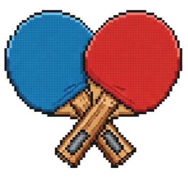
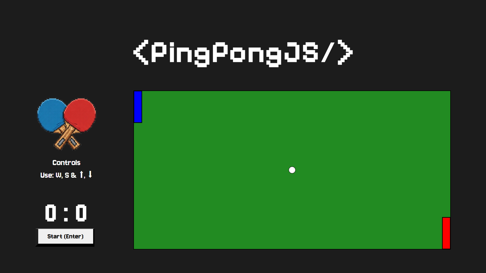

    

<h1 align="center">PingPongJS</h1>

A simple and fun browser-based Ping Pong game built using HTML, CSS, and JavaScript. Play against your friends and test your reflexes in a fast-paced rally. Clean UI, smooth gameplay, and fully responsive design — no installs needed, just open and play!

Paste link here

## 🔹 Features
1. Clean UI.
1. Simple & Easy to use controls.
1. Fast paced rallies as the game progresses.
1. Score tracking.
1. Reset option.
1. Lightweight.
1. Keyboard controls.
1. Nostalgic retro music.

## 🏓 About

This is a small hobby side project I created in my free time to learn the basics of HTML, CSS, and JavaScript. I’ve always enjoyed playing the classic ping pong video game on retro game consoles as a kid, so I thought it would be fun to recreate a simple version myself.

I originally built this a while ago as a way to practice core web development skills, and recently decided to clean it up, redesign it and share it here on GitHub. It’s not perfect, but it was a fun and valuable learning experience!

## 🎶 Music

8 Bit Menu - by David Renda. 

8-bit Nostalgic retro music for enhanced arcade-like feel. Thanks to https://www.youtube.com/@FesliyanStudios for the loyalty free audio. 

Check out their website https://www.fesliyanstudios.com

## 🎮 Controls
1. W & S keys for player 1.
1. Arrow Up and Arrow Down for player 2. 
1. Enter to start the game.
1. Spacebar to reset.

## 💻 Techstack

    

## 🤝🏻 Contribute
1. Fork this repository.
1. Create your own branch.
1. Commit changes.
1. Submit a pull request.

your code will be reviewed and request will be merged!

## 📝 License
This project is licensed under the MIT License.

Checkout [Liscence - MIT License. Copyright (c) 2023 Prathmesh Kale.](https://github.com/prathmesh-ka-github/Chessable/blob/main/LICENSE.md) for more info.

## 💛 Appreciation
Give this repo a star! Submit issues if you find bugs! 